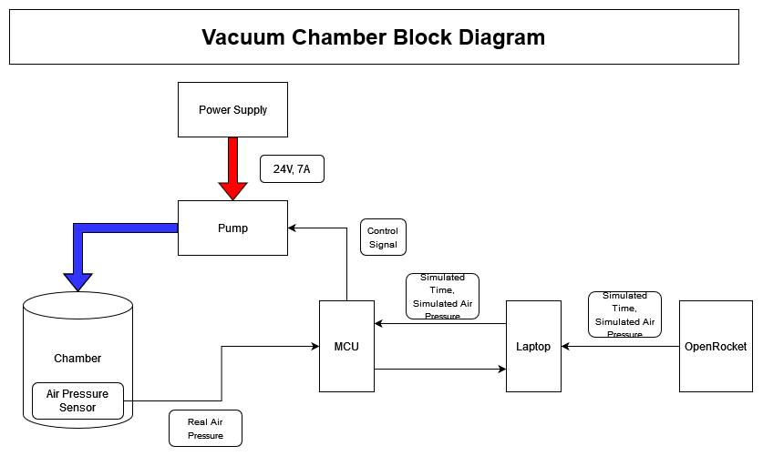

# DC Motor Controller for Vacuum Chamber

Prototype controller for DC motor based on air pressure sensor readings using the Nucleo-G071RB. 

Purpose is to allow for live control over pressure inside the chamber based on time and air pressure data outputted by OpenRocket simulations.

## Block Diagram
